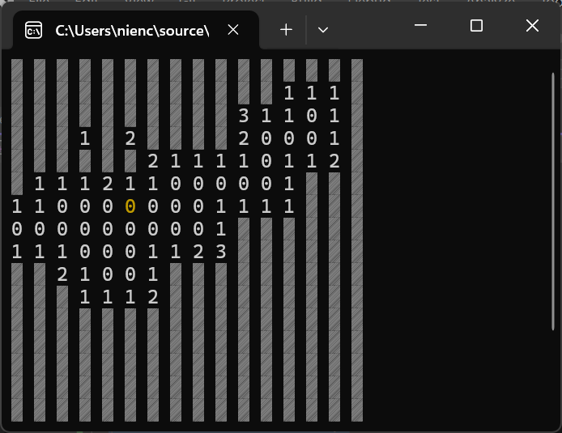

# Minesweeper Console Edition
## This is a simple text-based Minesweeper game implemented in C++ designed to be played directly in the console/terminal.
## Features
Classic Minesweeper gameplay.
Customizable board size and mine count.
Basic console UI with cursor controls.
Win and lose conditions implemented.
## How to Play
### Compile the code: Make sure you have a C++ compiler (like g++) installed on your system. Then compile the main.cpp file.
### Run the executable: This will launch the game in your terminal.
### Choose difficulty: Select from predefined difficulty levels or customize the board size and mine count.
### Use the controls:
    [WASD keys]: Move the cursor around the board.
    [M key]: Mark as boom.
    [Spacebar]: Reveal a tile.
### Gameplay:
Numbers on revealed tiles indicate the number of mines adjacent to them.
Use logic and deduction to avoid the mines and reveal all the safe tiles.
The game ends when you either reveal all safe tiles (you win!) or hit a mine (you lose).
## Controls
    [W]: Move cursor up
    [A]: Move cursor left
    [S]: Move cursor down
    [D]: Move cursor right
    [M]: Mark as boom
    [Spacebar]: Reveal tile
## Screenshots

## Author
[Richard Jacob](https://github.com/NienCongChua/)
## Contributing
Feel free to fork the repository and submit pull requests for any improvements or bug fixes.
